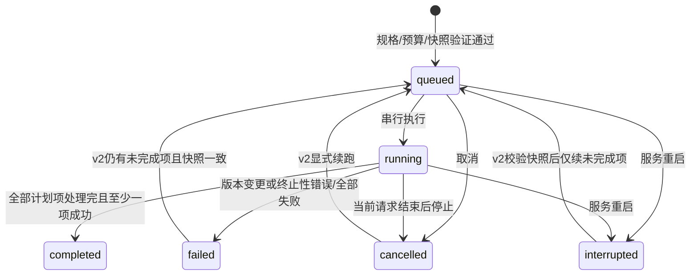

# 状态与历史语义

```mermaid
stateDiagram-v2
    [*] --> queued: 规格/预算/快照验证通过
    queued --> running: 串行执行
    queued --> cancelled: 取消
    running --> completed: 全部计划项处理完且至少一项成功
    running --> failed: 版本变更或终止性错误/全部失败
    running --> cancelled: 当前请求结束后停止
    queued --> interrupted: 服务重启
    running --> interrupted: 服务重启
    interrupted --> queued: v2校验快照后仅续未完成项
    cancelled --> queued: v2显式续跑
    failed --> queued: v2仍有未完成项且快照一致
```

completed 不等于所有回答正确，也不等于没有契约错误。错误已完成项不自动重试，所有计划项保留在分母。在途请求可能已在模型服务执行，续跑保留旧attempt并增加新attempt。新数据不得静默替换旧run快照。
